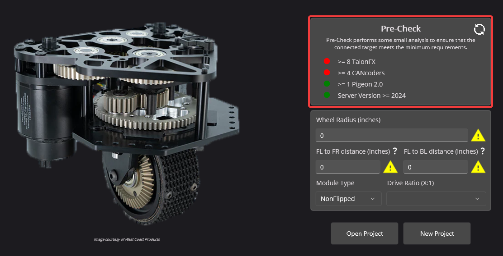

Swerve Requirements
===================

The swerve project creator and :doc:`swerve API </docs/tuner/tuner-swerve/index>` have several limitations. These limitations are in place to maximize performance and improve maintainability.

* Only Phoenix 6 supported hardware (e.g. Talon FX, Talon FXS, CANcoder, CANdi, Pigeon 2.0).

  * 8 Talon FX or Talon FXS (4 steer, 4 drive)
  * 4 CANcoder (4 steer) **OR** 4 Talon FXS + PWM encoder **OR** 4 CANdi
  * 1 Pigeon 2.0

* Requires Phoenix 6 software released for the current release year of Tuner X.

  * Firmware version of devices should match the API year (25.X firmware corresponds to 2025 API/Tuner)
  * Ensure Tuner X shows server version (located at the bottom of Tuner X) that matches the Tuner X major version (2025 Tuner X requires 2025 server version)

* Temporary diagnostic server (or an existing robot project for that year of software) must be running and Tuner should be connected to the robot.

  * This allows the generator to perform it's setup and auto-calibration routines

Some of these requirements are inforced via a mechanism called "precheck". You can see and refresh the precheck status by clicking the :guilabel:`Refresh` button in the top right.

.. note:: While the Swerve API and project generator can be utilized without Pro or FD, both of these enhance robot control. When utilizing Pro and CAN FD, sensor data is acquired synchronously. :ref:`FusedCANcoder <docs/migration/new-to-phoenix:fused cancoder>` improves the accuracy of module positions.

Requirement Checklist
---------------------

Users can utilize the below checklist to ensure their robot is ready for project generation.

.. list-table::
   :align: left
   :header-rows: 1
   :width: 100%
   :widths: 75 20

   * - Requirement
     - Done?
   * - **REQUIRED:** Is there the minimum number of devices?

       (8 Talon FX/FXS, 4 CANcoder/CANdi/Talon FXS + PWM encoder, 1 Pigeon 2.0)
     - .. raw:: html

           <input type="checkbox"/>

   * - **REQUIRED:** Do all devices appear in Tuner X?
     - .. raw:: html

          <input type="checkbox"/>

   * - **REQUIRED:** Are all devices on the same CAN bus?
     - .. raw:: html

          <input type="checkbox"/>

   * - **REQUIRED:** Is all firmware up-to-date? (25.X)
     - .. raw:: html

          <input type="checkbox"/>

   * - **REQUIRED:** Is the current year (2025) of diagnostics running?
     - .. raw:: html

          <input type="checkbox"/>

   * - **Recommended:** Have devices been renamed?

       (e.g. "TalonFX (Device ID 1)" -> "FL Steer Motor")

     - .. raw:: html

          <input type="checkbox"/>

   * - **Recommended:** Are the devices on a CANivore?
     - .. raw:: html

          <input type="checkbox"/>

   * - **Recommended:** Are the devices Pro-licensed?
     - .. raw:: html

          <input type="checkbox"/>

Once the user has reviewed the requirements, continue to :doc:`/docs/tuner/tuner-swerve/creating-your-project` to get started.
