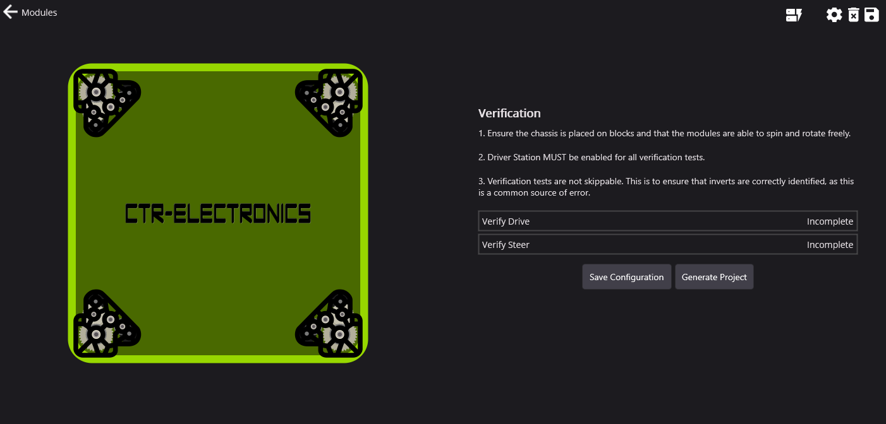
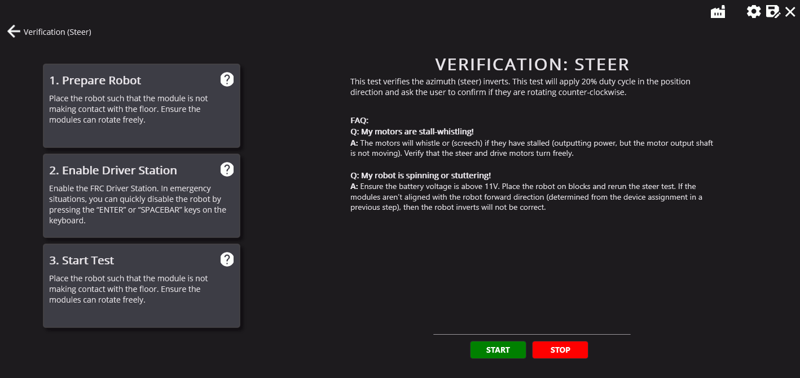
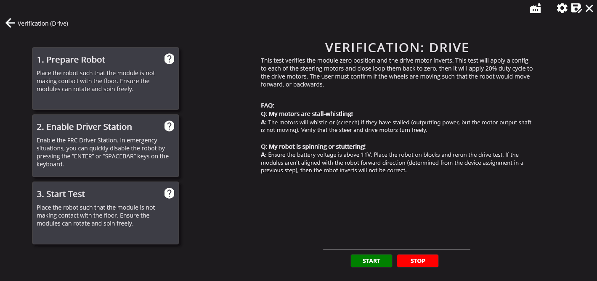

Validating the Drivetrain
=========================

Tuner performs several validation procedures to confirm inverts, offsets and mechanical functionality of the drivetrain.

This test consists of two steps:

* Verify Steer
* Verify Drive

Verify Steer
------------

The **Verify Steer** test is used to confirm that the module azimuth (or steer) can rotate freely and what direction they rotate in.

This test simply rotates all of the modules and confirms with the user if they rotated clockwise or counter-clockwise. The modules should rotate **counter-clockwise**.

Verify Drive
------------

The **Verify Drive** test is used to determine if the offsets were correctly applied and what the inverts of the drive motors should be. This process is as listed:

1. Rotate the modules until they are at position 0 (the module 0 should be calibrated from the :ref:`calibration <docs/tuner/tuner-swerve/configuring-your-modules:encoder calibration>` step).
2. Apply ~10% dutycycle.
3. Confirm with the user if the robot would've moved forward or backwards.

Without placing the robot on the ground, forward can be determined with the following steps.

1. Look at the robot from the right side of the robot.
2. Observe the wheels rotating. If the wheels rotate **clockwise**, this is forward (for the right side of the robot!).

Repeat for the left side of the robot, but instead of clockwise, forward is **counter-clockwise**.

Troubleshooting
---------------

A couple of common troubleshooting steps are listed below.

Q: The left or right-side of the drivetrain rotates in the wrong direction!
^^^^^^^^^^^^^^^^^^^^^^^^^^^^^^^^^^^^^^^^^^^^^^^^^^^^^^^^^^^^^^^^^^^^^^^^^^^

.. note:: If **both** sides are rotating in the incorrect direction, simply select :guilabel:`No` in the prompt that appears at the end of the test.

**Answer:** Go back to the configuration page and reperform CANcoder calibration. Ensure that the bevel gear of the robot is facing toward the vertical center of the robot and that the module is centered (either with a locking pin or ruler).

Q: The robot wheels did not move!
^^^^^^^^^^^^^^^^^^^^^^^^^^^^^^^^^

**Answer:** Ensure that the robot is enabled in the `FRC Driver Station <https://docs.wpilib.org/en/stable/docs/software/driverstation/driver-station.html>`__.

Q: The robot says the average velocity was too small!
^^^^^^^^^^^^^^^^^^^^^^^^^^^^^^^^^^^^^^^^^^^^^^^^^^^^^

**Answer:** Confirm what direction the wheel is rotating. Same solution as :ref:`docs/tuner/tuner-swerve/validating-drivetrain:q: the left or right-side of the drivetrain rotates in the wrong direction!`.

Q: My motors are stall-whistling
^^^^^^^^^^^^^^^^^^^^^^^^^^^^^^^^

**Answer:** The motors will whistle (or screech) if they have stalled (outputting power, but the motor output shaft can't move). Verify by hand that the steer and drive motors can turn freely.

Q: My robot is spinning or stuttering
^^^^^^^^^^^^^^^^^^^^^^^^^^^^^^^^^^^^^

**Answer:** Ensure the battery voltage is above 11V. Place the robot on blocks and rerun the steer test. If the modules aren't aligned the robot forward direction (determined from the device assignment in a previous step), then the robot inverts will not be correct.
