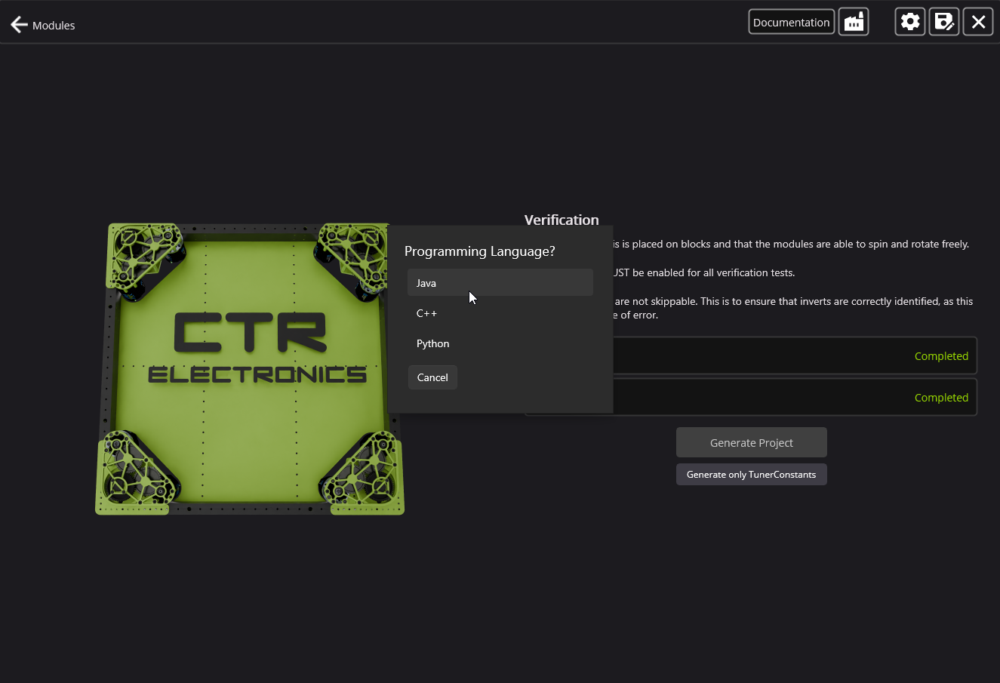
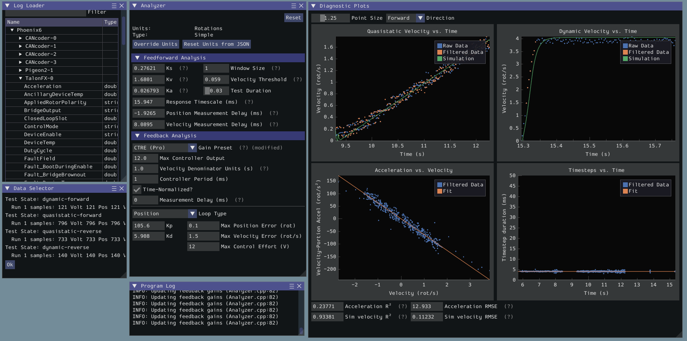
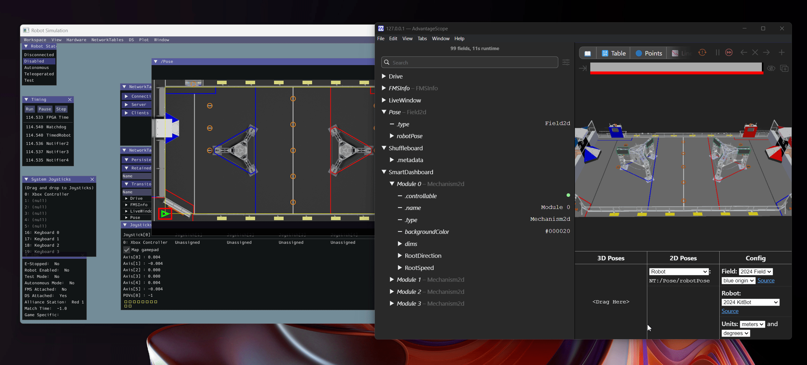
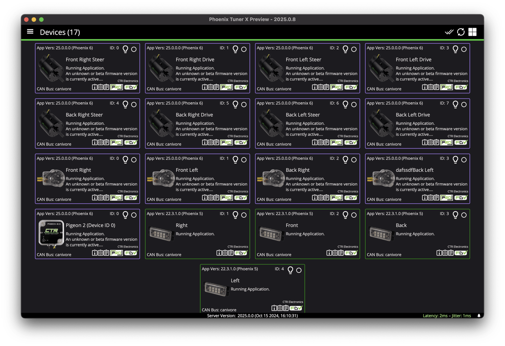
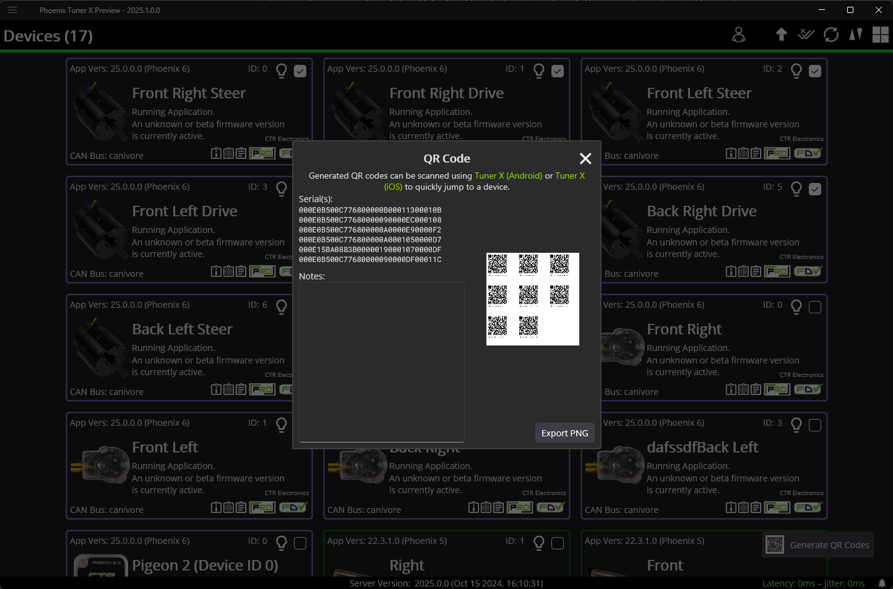

New for 2025
============

At CTR Electronics, we pride ourselves for taking our customer feedback seriously. The feedback our customers provide to us fosters a healthy and active developer ecosystem. Software changes constantly, as does our customers' needs. We will continue to invest in our customers' needs and we are proud to announce our changelog for the 2025 year!

Firmware for the 2025 release of Phoenix 6 can be found by selecting “2025” in the firmware selection menu.

The API vendordep for 2025 is available under ``https://maven.ctr-electronics.com/release/com/ctre/phoenix6/latest/Phoenix6-frc2025-beta-latest.json``.

Users will need to update both firmware and API to make use of these features.

.. note:: This changelog is intended to highlight the major additions to the Phoenix 6 API. For a detailed list of changes and bug fixes, visit the `API changelog <https://api.ctr-electronics.com/changelog>`__.

API
---

Additional Swerve Language Support
^^^^^^^^^^^^^^^^^^^^^^^^^^^^^^^^^^

The implementation of the Swerve API has been moved to C++ to improve portability and performance. These changes result in a substantial performance improvement, as the odometry thread no longer pauses during Java garbage collection when using native Phoenix ``SwerveRequest`` calls. Custom swerve request calls are still available; however, their usage may not benefit from the performance improvements due to GC overhead.

.. note:: The previous Java swerve implementation is still available with the prefix ``Legacy`` added to it.

With this change, we are also announcing Swerve API and Swerve Project Generator support for both Python and C++.

We recommend all Java users regenerate their swerve projects to pick up new features and various other improvements to the 2025 Swerve API and project generator.

Improved Swerve Requests
^^^^^^^^^^^^^^^^^^^^^^^^

After further testing, the SysId swerve requests have been improved to output usable gains for both drive and steer motors, as well as the ``HeadingController`` used in ``FieldCentricFacingAngle``.

Additionally, ``ApplyChassisSpeeds`` and ``SwerveModule.apply()`` now optionally accept (robot-relative) wheel force feedforward vectors. This allows the robot to more closely follow acceleration along autonomous paths.

Java Units Support
^^^^^^^^^^^^^^^^^^

Support for the `2025 WPILib Java units <https://docs.wpilib.org/en/latest/docs/software/basic-programming/java-units.html>`__ has been added to many APIs. This support includes:

- Units for status signals
- Unit overloads for control request parameters
- Unit overloads for config arguments
- Swerve API support for units

.. code-block:: java

   // status signals now return a unit type
   AngularVelocity velocity = m_motor.getVelocity().getValue();

   // users can alternatively use getValueAsDouble() to get a double value
   double velocity = m_motor.getVelocity().getValueAsDouble();

   // configs support units using the "with" decorators
   var currentConfigs = new CurrentLimitConfigs().withStatorCurrentLimit(Amps.of(120));

   // control requests support units for parameters
   m_motor.setControl(m_motionMagicPosition.withPosition(Degrees.of(90)));

.. important:: Users wishing to utilize the primitive ``double`` types with status signals can use ``getValueAsDouble()`` instead (Java, Python, C++).

Hoot Replay
^^^^^^^^^^^

Hoot Replay is a new feature that allows users to playback their hoot logs in their robot program. This allows them to view and interact with their devices in simulation using measurements from real world IO.

.. important:: Hoot Replay requires the hoot log to have a Pro-licensed device. Currently, only one hoot log may be replayed at a time.

Hoot Replay, controlled using the ``HootReplay`` class, supports playing back device status signals and custom user signals. Configs and control requests are ignored during replay.

During Hoot Replay, the simulated robot will automatically enable and run through all the maneuvers recorded in the hoot log. Additionally, Hoot Replay supports step timing and changing the speed of the playback.

Hoot Replay uses a different vendordep, found at ``https://maven.ctr-electronics.com/release/com/ctre/phoenix6/latest/Phoenix6-replay-frc2025-beta-latest.json``. This vendordep replaces :doc:`/docs/canivore/canivore-hardware-attached` with Hoot Replay. Note that only one Phoenix 6 vendordep may be used in the ``vendordeps`` folder at a time.

Current Limiting Improvements
^^^^^^^^^^^^^^^^^^^^^^^^^^^^^

Both supply and stator current limits now apply in TorqueCurrentFOC control. Additionally, supply current limiting is now more responsive and has been reworked to better prevent brownouts.

Previously, when ``SupplyCurrentThreshold`` and ``SupplyTimeThreshold`` were configured, the Talon FX would allow **unlimited** supply current until it exceeded the ``SupplyCurrentThreshold`` for ``SupplyTimeThreshold``, after which the ``SupplyCurrentLimit`` takes effect. This was useful to maximize motor performance without tripping breakers. However, it was ineffective at preventing brownouts.

As a result, the behavior of the supply current limiter has been changed:

- The supply current limiter never allows more current draw than the configured ``SupplyCurrentLimit``, preventing brownouts.
- ``SupplyCurrentThreshold`` and ``SupplyTimeThreshold`` have been replaced with (optional) ``SupplyCurrentLowerLimit`` and ``SupplyCurrentLowerTime`` parameters.
- If supply current has been limited for ``SupplyCurrentLowerTime``, the supply current limit is reduced to the ``SupplyCurrentLowerLimit`` until current drops below the lower limit, preventing breaker trips.

Additionally, the following default current limits are now in place:

- Stator current limit of 120 A
- Supply current limit of 70 A
- Supply current lower limit of 40 A after limiting (at 70 A) for 1 second

Timesync Control
^^^^^^^^^^^^^^^^

For Pro-licensed devices on a CANivore, timesync can now be used with control requests to delay applying the request until a timesync boundary. This eliminates the impact of nondeterministic network delays in exchange for a larger but deterministic control latency.

Deprecations/Removals
^^^^^^^^^^^^^^^^^^^^^

- Deprecated ``Pigeon2::getAngle()`` and ``Pigeon2::getRate()``
- Deprecated ``TalonFX::setInverted()``
- Removed ``SupplyCurrentThreshold`` and ``SupplyTimeThreshold``
- TalonFX no longer directly implements MotorController

  - The APIs associated with MotorController are still available, but this gives us the flexibility to make QOL adjustments to the API (such as returning StatusCodes)

Miscellaneous API Improvements
^^^^^^^^^^^^^^^^^^^^^^^^^^^^^^

- C++: Configs now use the C++ units library
- C++: Configs are now ``constexpr``
- Python: Added WPILib integrations to device classes
- The ``CANBus`` API is now instantiable, and device constructors now have an overload accepting a ``CANBus`` object
- Added an overload to device status signal getters to pull out the ``StatusSignal`` without refreshing
- Added ``Utils.fpgaToCurrentTime()`` helper function to convert an FPGA timestamp to the timebase of ``Utils.getCurrentTimeSeconds()``
- Robot state (teleop/auton/etc.) is now automatically logged in hoot files
- Simulation: Improved performance and fixed frequent stale frame warnings
- Simulation: Added support for simulating Pigeon 2 angular velocities
- Improved API documentation of several configs, controls, and status signals

Phoenix Tuner X
---------------

Windows: https://apps.microsoft.com/store/detail/9N17NS6NM06V
Android: https://play.google.com/store/apps/details?id=com.ctre.phoenix_tuner&hl=en_US
macOS & iOS: https://apps.apple.com/us/app/phoenix-tuner-x-preview/id6502530040

iOS and macOS Support
^^^^^^^^^^^^^^^^^^^^^

Added support for iOS and macOS. The application is available for a one-time cost to offset Apple development costs. We are actively investigating making iOS and macOS Tuner X free for season pass licensed teams but we cannot offer a timeline at this time.

Enhanced Plotting
^^^^^^^^^^^^^^^^^

.. image:: images/tuner-plotter.gif
   :width: 650

Plotting has been redone from the ground up to maximize accuracy, performance, and usability.

- Users can zoom and pan individual axes, and the entire plot.
- Explicit points have been added to indicate if there are gaps in retrieved data.
- Signals are plotted at their specified update frequency, ensuring there is no data lost.
- Plotter has been benchmarked for millions of points, maximizing plot performance.
- Clicking on the plot will bring up a selection box that will indicate the X/Y range of the provided selection.
- Hovering on the plot will highlight and show the value of the nearest point for all signals.
- Users can export the current enabled signals as a CSV.
- Added a new signal analysis tab (accessed at the bottom of the device page).

  - Users can customize the visualization of their signals, specifying point markers, colors, min/max, grid lines, or reset zoom on an individual series
  - Statistics tab shows real time statistics for the currently selected series
  - Signals can be grouped together by adding a new group, then dragging the signals in them. Grouped signals will share minimum and maximum, and scale for all plot zoom and pan operations.

QR Code Hot-Launch
^^^^^^^^^^^^^^^^^^

QR codes for a given device can be generated on desktop platforms. Individuals can scan the QR code on their mobile phone to launch Tuner navigating to the provided device.

Notification Support
^^^^^^^^^^^^^^^^^^^^

Tuner X for Android and iOS supports notifications. Get notified when critical firmware or API releases are available.

Miscellaneous Tuner Improvements
^^^^^^^^^^^^^^^^^^^^^^^^^^^^^^^^

- Up to an 88% improvement in device navigation speed.
- Renamed the "Device History" tab to "Tuner History", which contains both "Device History" and "Network History". Network history highlights all previous robot networks that the Tuner has connected to.
- Added support for POST diagnostic requests, improving portability and performance.
- Added support for dynamically downloading the necessary version of Owlet for hoot.
- Added a changelog flyout in Tuner. Click on the bell icon at the bottom right to view the latest changes in Tuner, API, or firmware.
- Tuner Configs indicate if the current config value is not the default config value.
- Tuner Configs indicate if the current config value is not within the acceptable minimum and maximum range of the config.
- Added tooltips for enums and configs in Tuner.
- Invert is no longer a boolean config, but instead an enum which matches API.

Infrastructure and Tooling
--------------------------

We now publish an RSS feed at https://api.ctr-electronics.com/rss/rss.xml

Additionally, there is now a webpage for downloading various CTR Electronics CLI utilities. These utilities include Owlet, Passerine, Phoenix Diagnostics Server, and Caniv.

Please see the webpage for a description on what these tools are and how to download them.

https://docs.ctr-electronics.com/cli-tools

