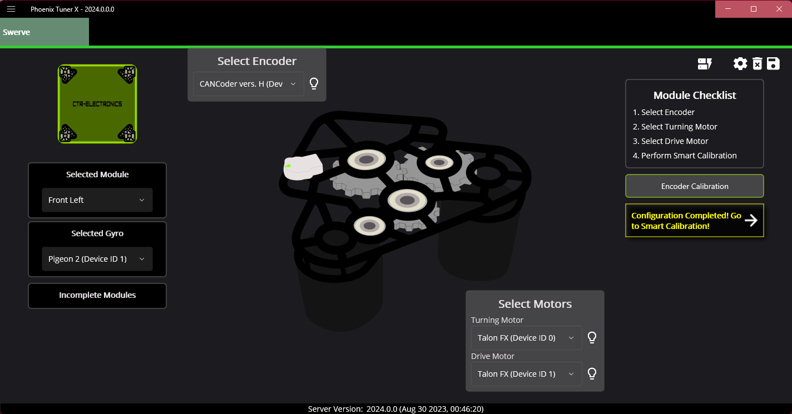
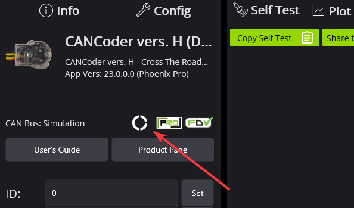
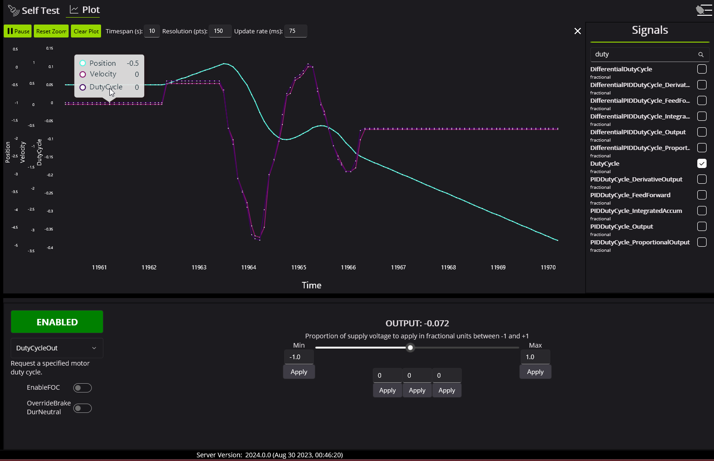

New for 2024
============

The CTR Electronics development team has been hard at work expanding the Phoenix 6 API based on user feedback. We are proud to announce several exciting new features with this release!

.. note:: This changelog is intended to highlight the major additions to the Phoenix 6 API. For a detailed list of changes and bug fixes, visit the `Phoenix changelog <https://api.ctr-electronics.com/changelog>`__.

Phoenix Pro Licensing
---------------------

Introduced earlier this year is the new season pass licensing model. Season pass improves licensing flexibility when utilizing multiple robots and the roboRIO CAN bus. Additional information on this can be found in the `blog post <https://store.ctr-electronics.com/blog/phoenix-pro-licensing-announcing-season-pass/>`__.

Also a reminder that many of the features available in Phoenix 6 do **not** require Pro to use. A full breakdown of what is and isn't supported is available under `the feature table <docs/migration/new-to-phoenix:feature breakdown>`

A variety of new Pro features have been added and are described in the API section below.

API
---

New Language Support
^^^^^^^^^^^^^^^^^^^^

Phoenix 6 now supports the following languages.

- Java
- C++
- `Python <https://pypi.org/project/phoenix6/>`__
- `C# <https://www.nuget.org/packages/Phoenix6/>`__ (non-FRC only)

Feedback for the new language targets is welcome at our support email (`feedback@ctr-electronics.com <mailto:feedback@ctr-electronics.com>`__).

Swerve API
^^^^^^^^^^

Now included in the Phoenix 6 API is a high performance Swerve API (Java). Teams using v6 compatible devices for their swerve drivetrain can utilize the API to maximize performance and **eliminate** the boilerplate that comes with copying swerve template code. Empower your odometry and maximize your robot responsiveness with our synchronous, latency-compensated API with simulation support!

To complement the Swerve API, we've added a project generation utility to handle boilerplate related to inverts, offsets and gearing. Usage docs are available here.

Swerve drive code is as easy as the following.

.. note:: The following example utilizes a generated ``TunerConstants`` class from Tuner X, but users can create the ``CommandSwerveDrivetrain`` or ``SwerveDrivetrain`` directly if they prefer. Additionally, this API is currently only available for Java.

.. code-block:: java

   /* Setting up bindings for necessary control of the swerve drive platform */
   CommandXboxController joystick = new CommandXboxController(0); // My joystick
   CommandSwerveDrivetrain drivetrain = TunerConstants.DriveTrain; // My drivetrain
   SwerveRequest.FieldCentric drive = new SwerveRequest.FieldCentric().withIsOpenLoop(true); // I want field-centric
                                                                                             // driving in open loop
   SwerveRequest.SwerveDriveBrake brake = new SwerveRequest.SwerveDriveBrake();
   SwerveRequest.PointWheelsAt point = new SwerveRequest.PointWheelsAt();
   Telemetry logger = new Telemetry(MaxSpeed);

   private void configureBindings() {
      drivetrain.setDefaultCommand( // Drivetrain will execute this command periodically
      drivetrain.applyRequest(() ->
         drive.withVelocityX(-joystick.getLeftY() * MaxSpeed) // Drive forward with negative Y (forward)
         .withVelocityY(-joystick.getLeftX() * MaxSpeed) // Drive left with negative X (left)
         .withRotationalRate(-joystick.getRightX() * MaxAngularRate) // Drive counterclockwise with negative X (left)
         )
      );

      joystick.a().whileTrue(drivetrain.applyRequest(() -> brake));
      joystick.b().whileTrue(drivetrain
         .applyRequest(() -> point.withModuleDirection(new Rotation2d(-joystick.getLeftY(), -joystick.getLeftX()))));

      if (Utils.isSimulation()) {
         drivetrain.seedFieldRelative(new Pose2d(new Translation2d(), Rotation2d.fromDegrees(90)));
      }

      drivetrain.registerTelemetry(logger::telemeterize);
   }

.. figure:: images/swerve-simulation-video.*
   :alt: GIF showing swerve simulation support

.. important:: Swerve API requires all necessary swerve devices to be v6 devices. e.g. 4 drive TalonFX, 4 steer TalonFX, 1 Pigeon 2.0, 4 CANcoders.

Signal Logging
^^^^^^^^^^^^^^

We've added a comprehensive signal logger API (Java, C++, Python) that represents a real-time capture of signals for supported devices. Signal logging can be useful for analysis of signals over a period of time. In applications, they can be useful for tuning PID gains, characterization of systems, analyzing latency on a system and much more. Did something unexpected happen in a match? Go back andcheck your logs to inspect positions, velocities, voltages, currents, temperatures, etc. Logging is automatic, and does not require choosing which signals you need captured ahead of time.

.. important:: MCAP Export requires Pro Licensing

.. note:: Documentation on configuring and extracting logs will be available soon.

.. grid:: 2

   .. grid-item-card:: Log Extractor

      Logs can be extracted and converted to compatible formats directly in Tuner X.

      .. image:: images/tuner-x-log-extractor.png
         :alt: Log extractor page in Tuner X

   .. grid-item-card:: Foxglove Log Analysis

      Logs can then be analyzed in Foxglove to identify hardware failures, tuning gains, etc.

      .. image:: images/foxglove-example.png
         :alt: Picture of foxglove analyzing data

Signal API Improvements
^^^^^^^^^^^^^^^^^^^^^^^

Users can now disable signals by setting their update rate to 0Hz. To reduce boilerplate when disabling signals, we have added an ``optimizeBusUtilization()`` function on a given device object. This will automatically disable all signals that have not explicitly been given an update frequency with ``setUpdateFrequency()``. There is also an ``ParentDevice.optimizeBusUtilizationForAll()`` static function that takes a list of devices to optimize. Frequencies are also automatically reapplied when devices reset.

Setting a given signal's frequency behavior has been improved by keeping track of the signal with the highest frequency in a frame. The highest frequency's signal is used for the frame instead of the most recent signal.

Additionally, the following new functions have been added.

* ``BaseStatusSignal.refreshAll()``

  * refreshes all passed in signals

* ``BaseStatusSignal.setUpdateFrequencyForAll()``

  * sets a given frequency update frequency for all passed in signals

* ``getAppliedUpdateFrequency()``

  * retrieves the actual update frequency of a given signal

New Motion Magic Controls
^^^^^^^^^^^^^^^^^^^^^^^^^

For a full list of new motion magic controls, see the controls API documentation (Java, C++, Python).

Differential Mechanisms
^^^^^^^^^^^^^^^^^^^^^^^

.. important:: ``DifferentialMechanism`` requires both Pro and CANFD. ``SimpleDifferentialMechanism`` is a lower performance alternative that requires neither.

``DifferentialMechanism`` provides an easy way to control two-axis differential mechanisms such as two motor elevators (motor on the left and right side of the elevator but is not mechanically linked). Information on this is available here.

New Configs
^^^^^^^^^^^

We've added several new configs. A full list of available configs is available in the ``configs`` (Java, C++, Python) namespace.

Improved Support for roboRIO Motion Profiles
^^^^^^^^^^^^^^^^^^^^^^^^^^^^^^^^^^^^^^^^^^^^

Additional support has been added for various feedforward terms (kS, kG, kV and KA). There is now improved integration with roboRIO motion profiling using velocity setpoints in position control modes, along with acceleration setpoints in velocity control modes.

.. code-block:: java

   var constraints = new TrapezoidProfile.Constraints(80, 160); // 80 rps, 160 rps/s
   var goal = new TrapezoidProfile.State(200, 0); // 200 rot, 0 rps
   var profile = new TrapezoidProfile(constraints, goal);

   var setpoint = profile.calculate(0.020);
   m_positionControl.Position = setpoint.position;
   m_positionControl.Velocity = setpoint.velocity;
   m_talonFX.setControl(m_positionControl);

New ``SyncCANcoder`` Remote Sensor
^^^^^^^^^^^^^^^^^^^^^^^^^^^^^^^^^^

Added support for ``SyncCANcoder`` feedback. This allows users to synchronize the TalonFX's internal rotor sensor against the remote CANcoder, but continue to use the rotor sensor for all closed loop control. TalonFX will continue to monitor the remote CANcoder and report if its internal position differs significantly from the reported position, or if the remote CANcoder disappears from the bus. Users may want this instead of FusedCANcoder if there is risk that the sensor can fail in a way that the sensor is still reporting "good" data, but the data does not match the mechanism, such as if the entire sensor mount assembly breaks off. Users using this over FusedCANcoder will not have the backlash compensation, as the CANcoder position is not continually fused in.

Miscellaneous Improvements
^^^^^^^^^^^^^^^^^^^^^^^^^^

* Orchestra has been ported from v5.

  * Now supports multiple devices playing a single track.
  * Now works when the robot is disabled.
  * A new control mode ``MusicTone`` has been added and can be used for playing a specific frequency.

* Remote limits have been ported from v5.
* Improved support for unit tests.

Tuner
-----

Swerve Project Generator
^^^^^^^^^^^^^^^^^^^^^^^^

Swerve has many common pitfalls (inverts, encoder offsets, gearing, etc). Utilizing our new Tuner X Swerve Project Generator can help eliminate these problems. This utility will guide the user through specifying their drivebase characteristics, device selection, cancoder offset configuration and drive/steer validation. This utility will then generate a project that provides minimum viable swerve control!

.. important:: This utility does not characterize the swerve. To maximize robot responsiveness, we recommend characterizing and modifying the gains specified in the generated ``TunerConstants`` class.

.. add docs page adding information on the swerve API

CANcoder Zero Button
^^^^^^^^^^^^^^^^^^^^

.. important:: This feature requires 2024 diagnostics or newer.

CANcoders can be zeroed by pressing on the button below. This applies an offset to the encoder config and reports the applied offset to the user.

Improved Plotting
^^^^^^^^^^^^^^^^^

.. important:: This feature requires 2024 diagnostics or newer.

All signals exposed in API can now be plotted directly in Tuner X.

