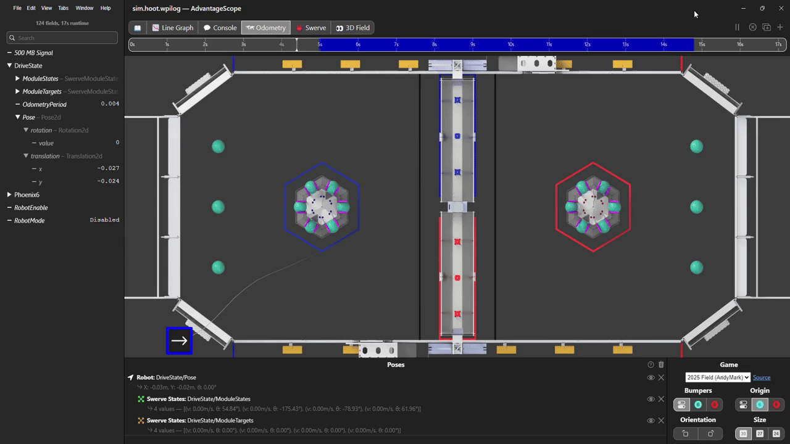
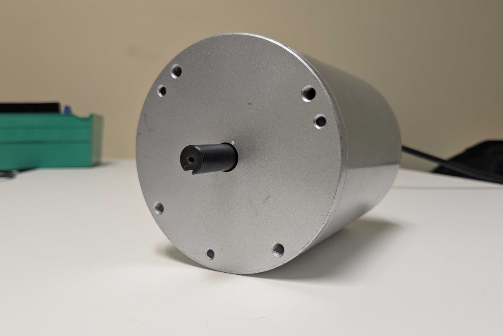
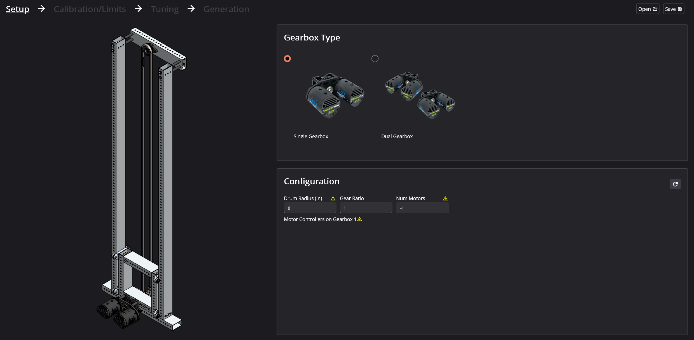
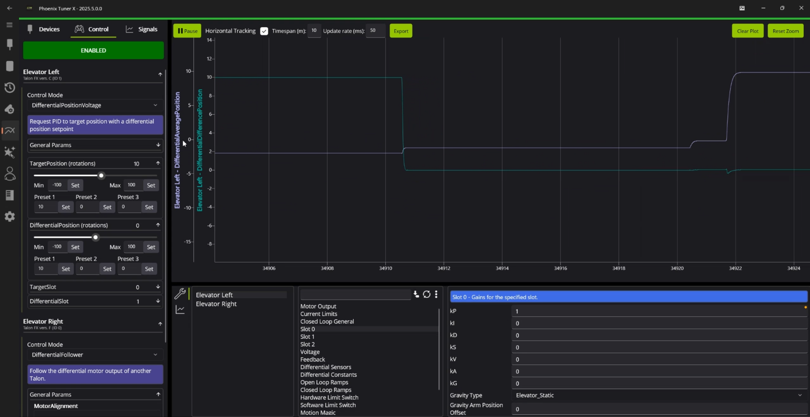
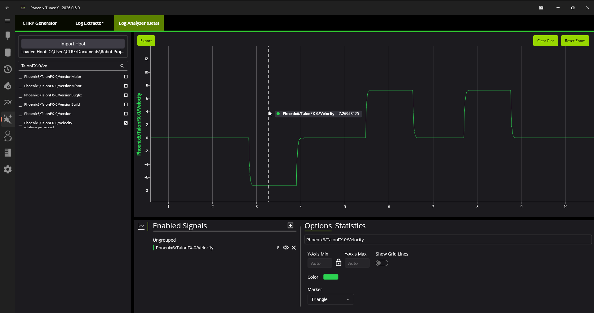
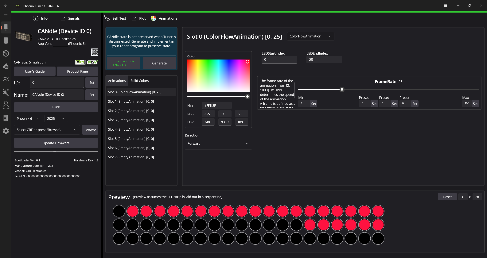

New for 2026
============

Engineering never stops, and neither do we. At CTR Electronics, we are constantly analyzing and reflecting on our software, documentation and hardware integration. This past year, we've made immense investments in our differential stack, data analysis with Tuner, data logging and replay pipeline and much more. We are proud to present our new for 2026 changelog!

Firmware for the 2026 release of Phoenix 6 can be found by selecting "2026" in the firmware selection menu.

The API vendordep for 2026 is available under ``https://maven.ctr-electronics.com/release/com/ctre/phoenix6/latest/Phoenix6-frc2026-latest.json``.

Users will need to update both firmware and API to make use of these features.

.. note:: This changelog is intended to highlight the major additions to the Phoenix 6 ecosystem. For a detailed list of changes and bug fixes, visit the `API changelog <https://api.ctr-electronics.com/changelog>`__.

API
---

Breaking Changes
^^^^^^^^^^^^^^^^

- The ``new <Device>(int id, String canbus)`` constructors are now deprecated and will be removed in 2027. Use the ``new <Device>(int id, CANBus canbus)`` constructors instead. This change is intended to prepare users for 2027, where an explicit CAN bus declaration is necessary.
- The minimum supported C++ version is now C++ 20, and the minimum Linux requirement is Ubuntu 22.04 / Debian Bookworm. Linux ARM32 is no longer supported.
- C++: Improved robot project compilation times. This results in the following breaking changes: The ``ctre/phoenix6/configs/Configs.hpp`` header has been split into separate files. In generated swerve projects, ``TunerConstants.h`` must now explicitly include the motor controllers and encoder used.
- ``DifferentialMechanism`` and ``SimpleDifferentialMechanism`` have been reworked to more closely align with the swerve API. The behavior of the difference axis has also been adjusted.

Signal Logger Improvements & Behavior Changes
^^^^^^^^^^^^^^^^^^^^^^^^^^^^^^^^^^^^^^^^^^^^^

Signal logger has had quite a few changes over the off-season. Signal Logger now has support for `Protobuf <https://github.wpilib.org/allwpilib/docs/release/java/edu/wpi/first/util/protobuf/Protobuf.html>`__ and `WPILib Structs <https://github.wpilib.org/allwpilib/docs/release/java/edu/wpi/first/util/struct/Struct.html>`__, arbitrarily sized user signals, and annotation-based logging as an :doc:`Epilogue Backend </docs/api-reference/wpilib-integration/epilogue-integration>`.

The behavior of the signal logger auto-start functionality has also been changed in response to user feedback to make the experience consistent between at-home testing and events. Signal Logging auto start is **only enabled** on the roboRIO 1 if a flash drive is present, and otherwise enabled by default on the roboRIO 2. Signal logging is started by any of the following (whichever occurs first):

- The robot is enabled
- It has been at least 5 seconds since program startup (allowing for calls to ``setPath``), and the Driver Station is connected to the robot.

Additionally, ``OptimizeBusUtilization()`` now defaults to setting optimized signals to 4 Hz instead of 0 Hz, preserving data for hoot logs. Users can still get the old behavior by explicitly passing in 0 Hz.

.. dropdown:: Miscellaneous Changes

   - Logs from the same robot program instance / FRC match will now be grouped into a subdirectory named after the match and the date/time of the start of the match.
   - The list of :ref:`docs/api-reference/api-usage/signal-logging:free signals` (including custom user signals) is no longer limited to WPILOG export and can now be exported to MCAP.

Hoot Replay Improvements
^^^^^^^^^^^^^^^^^^^^^^^^

Hoot replay has been enhanced to simplify use cases beyond status signal playback. A ``HootAutoReplay`` API has been added to easily register custom "input" signals for logging on hardware and playback in replay. This also enables easy replay of the robot FPGA timestamp and joystick information.

.. code-block:: java

   private final Camera camera = new Camera(...);
   private PoseEstimate cameraPoseEst = new PoseEstimate();

   private final HootAutoReplay autoReplay = new HootAutoReplay()
      .withTimestampReplay()
      .withJoystickReplay()
      .withStruct(
         "CameraPoseEst/pose", Pose2d.struct,
         /* getter lambda returns the value to log */
         () -> cameraPoseEst.pose,
         /* setter lambda applies the value from the log */
         val -> cameraPoseEst.pose = val.value
      )
      .withDouble(
         "CameraPoseEst/timestamp",
         () -> cameraPoseEst.timestamp,
         val -> cameraPoseEst.timestamp = val.value
      );

   private void fetchInputs() {
      cameraPoseEst = camera.getPoseEstimate();
   }

   @Override
   public void robotPeriodic() {
      if (!Utils.isReplay()) {
         fetchInputs();
      }
      autoReplay.update();
   }

We highly recommend reading over the :doc:`improved hoot replay </docs/api-reference/api-usage/hoot-replay>` documentation for understanding how to integrate hoot replay into your robot program.

Additionally, the Signal Logger is now supported in Hoot Replay with the following behavior:

- Signal Logger is always enabled during replay. As a result, ``SignalLogger::Start()`` and ``SignalLogger::Stop()`` are ignored.
- The replayed log will always be written to a ``replay_<date>_<time>/`` subfolder next to the original log.
- All custom signals written during replay will be automatically placed under ``hoot_replay/`` in the log.
- The replayed log also contains all status signals and custom signals from the original log, excluding those starting with ``hoot_replay/``.

This can be useful to log the new outputs after making changes to program logic.

Investments in Differential
^^^^^^^^^^^^^^^^^^^^^^^^^^^

Our differential API has seen a variety of changes and feature additions that should enhance and expand the capabilities of teams building differential systems (such as Differential Wrists or Elevators). ``SimpleDifferentialMechanism`` and ``DifferentialMechanism`` have been reworked to more closely align with swerve. Both APIs now take a ``DifferentialMotorConstants`` object on construction, internally construct and configure the motor controllers (with initial configs objects), and provide useful APIs such as ``getAveragePosition()`` and ``setPosition(avg, diff)``. Support has also been added for ``MotionMagicExpo`` and ``MotionMagicVelocity`` on the average axis.

Additionally, configs have been added to control the behavior of continuous wrapping and gear ratios on the difference axis. This also comes with a **breaking change** in behavior on the differential axis: the **full differential output** is now added/subtracted from each motor, and the difference axis uses **half the difference** in position/velocity between the two motors. This effectively means that PID gains do not change, but setpoints on the difference axis must be halved.

User documentation for the differential API can be found :doc:`here </docs/api-reference/mechanisms/differential/differential-overview>`. We highly recommend users read over the `full changelog <https://api.ctr-electronics.com/changelog>`__ for a full list changes to the differential API.

Improvements to Swerve
^^^^^^^^^^^^^^^^^^^^^^

Swerve has seen a number of enhancements. We've added a ``LinearPath`` API that generates a linear path between two poses with constant velocity and acceleration limits. A ``WheelForceCalculator`` has also been added that calculates the wheel force feedforwards to apply for the given target robot accelerations or change in ``ChassisSpeeds``, based on the robot mass and MOI.

The generated swerve project has been updated to include a default "drive straight" autonomous command that slowly drives forward for 5 seconds.

Additionally, the ``SeedFieldCentric(Rotation2d)`` overload has been added to reset the heading of the robot to the given operator-perspective heading. The generated swerve project has also been updated to include a simple drive-straight auton and log to ``SignalLogger`` using the new WPILib Struct and Struct array support.

Additional Language Support for C#
^^^^^^^^^^^^^^^^^^^^^^^^^^^^^^^^^^

.. image:: images/csharp-demo.gif
   :alt: Video of running a WinUI3 app that manipulates a simulated Talon

C# has received some much needed updates that bring it to feature parity with the other supported languages. C# fits the middle-ground for users looking for type safety without using an unmanaged language like C++.

Check out the :ref:`installation instructions <docs/installation/installation-nonfrc:API Installation>` on installing the nuget.

Additional Utility Functions
^^^^^^^^^^^^^^^^^^^^^^^^^^^^

We've added a couple new utility functions, specifically for interacting with status signals.

- Added ``StatusSignal::IsNear(target, tolerance)`` utility function that checks whether the signal is near a target value given tolerance.
- Added ``StatusSignalCollection``, a lightweight ``List<BaseStatusSignal>`` wrapper that provides ``waitForAll``/``refreshAll``/etc. This can be used to easily register status signals from multiple classes for a single ``refreshAll`` call.
- Java: Added ``List<BaseStatusSignal>`` overloads to ``waitForAll``/``refreshAll``/etc.
- C++: Replaced the ``std::vector`` and ``std::array`` overloads with a ``std::span`` overload for APIs such as ``WaitForAll``/``RefreshAll``/``OptimizeBusUtilization``/etc.

Enhancements to Error Reporting
^^^^^^^^^^^^^^^^^^^^^^^^^^^^^^^

Some changes have been made to the API to improve error reporting.

- StatusSignal ``WaitForAll()`` and ``RefreshAll()`` now report errors for all the status signals involved that errored.
- StatusSignal ``WaitForAll()`` and ``RefreshAll()`` now propagate an ``InvalidNetwork`` error to all the provided status signals.

Talon FX Improvements
---------------------

Improvements to follower have been made, specifically in regards to when the leader active request is Voltage-based.

- Follower and DifferentialFollower now follow ``MotorVoltage`` instead of ``DutyCycle`` when the leader is running a voltage control output type.
- Follower now follows the leader's coast/brake.

Additionally, :ref:`docs/api-reference/device-specific/talonfx/motion-magic:dynamic motion magic® expo` control requests have been added. Furthermore, the ``GravityArmPositionOffset`` config has also been added to offset the position used for arm kG calculations (within (-0.25, 0.25) rot).

.. dropdown:: Miscellaneous Changes

   - Added support for simple gain scheduling in position PID closed-loop control based on closed-loop error. For more information, see the API documentation of ``ClosedLoopGeneralConfigs::GainSchedErrorThreshold``, ``ClosedLoopGeneralConfigs::GainSchedKpBehavior``, and ``SlotConfigs::GainSchedBehavior``.
   - Added ``MotionMagicAtTarget`` status signal, which returns whether the motion profile has completed (equivalent to checking that ``MotionMagicIsRunning``, the ``ClosedLoopReference`` is the final target, and the ``ClosedLoopReferenceSlope`` is 0).

Kraken X44
^^^^^^^^^^

Improvements to FOC have been made to improve peak performance.

Additionally, Kraken X44 simulation support has been added via ``TalonFXSimState::SetMotorType``.

Talon FXS
^^^^^^^^^

Our **non-FRC** customers can now utilize generic sensored (with hall effects) BLDC motors up to 24V on Talon FXS. This enables use cases for industrial motors in automation. Take a look at the ``Custom Brushless Motor`` configs for more information on how to configure this.

Phoenix Tuner X
---------------

Tuner has seen a number of new feature additions, bug fixes, and general improvements.

Elevator Mechanism Support
^^^^^^^^^^^^^^^^^^^^^^^^^^

Under the Mechanisms page in Tuner X is the Elevator Generator. This utility guides the user through determining the necessary constants and configurations for a working Elevator subsystem. Take a read through the :doc:`relevant documentation pages </docs/tuner/tuner-elev/index>` for information on how this works!

Multi-device Control & Plot
^^^^^^^^^^^^^^^^^^^^^^^^^^^

One of the most asked features of Phoenix Tuner has been the ability to control and plot multiple devices simultaneously. We are proud to announce that this feature will now be available for the 2026 season. This page can be found in the left-hand sidebar.

Integrated Log Analysis (Beta)
^^^^^^^^^^^^^^^^^^^^^^^^^^^^^^

Hoot logs can now be directly plotted in Tuner. This feature is marked as beta as we continue to refine and improve the process. This page is available by going to :guilabel:`Tools` (magic wand in the sidebar) and then clicking on :guilabel:`Log Analyzer (Beta)`.

Feedback is welcome and can be submitted by sending us an `email <mailto:support@ctr-electronics.com>`__!

CANdle Animations Preview
^^^^^^^^^^^^^^^^^^^^^^^^^

The traditional control interface has been replaced with a CANdle animations tab, directly in Tuner. This allows you to have a real-time preview of the state of your LED strip and also includes generation functionality. The built-in generator will take your current CANdle animations and solid colors, and create a subsystem that you can implement in your robot program.

Miscellaneous Improvements
^^^^^^^^^^^^^^^^^^^^^^^^^^

Beyond the big ticket feature adds is loads of smaller enhancements throughout the application.

- Reworked the flyout to be minimized by default and show a flat list of icons.
- Reworked configs to be a nested menu. This improves the performance and makes it more reusable across the application.
- Added support for extracting and deleting folders on the Hoot Extractor page.
- Added batch licensing to device history.
